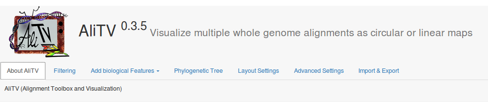
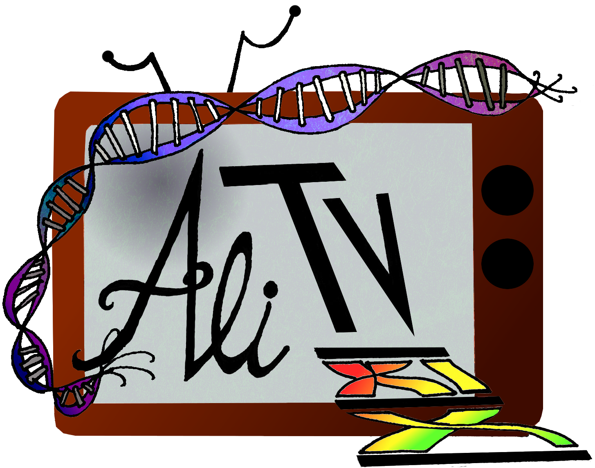

| ****

| **Version 0.3.1**

|image|

About AliTV
===========

AliTV (Alignment Toolbox & Visualization) is a free software for
visualizing whole genome alignments as circular or linear maps. The
figure is presented on a HTML-page with an easy-to-use graphical user
interface. Comparisons between multiple genomic regions can be
generated, interactively analyzed and exported as svg.

Installation
============

Tutorial I: Simple comparasion of chloroplast genomes
=====================================================

In this example chloroplast genomes of seven parasitic and non-parasitic
plants are compared and analyzed with AliTV. The files needed for this
tutorial are used as the default data, this means you must not import
them.

Otherwise the files are available to download from...

Visualizing the Whole-Genome Alignment
^^^^^^^^^^^^^^^^^^^^^^^^^^^^^^^^^^^^^^

-  Open ``AliTV.html`` with your favourite webbrowser. When you use
   AliTV the first time the chloroplast data are used as the default
   data.

   .. figure:: showLabels.png
      :alt: The AliTV image using the default configuration.

      The AliTV image using the default configuration.
-  As you can see seven chloroplast genomes and the alignments between
   adjacent genomes are visualized. The genome of *N. tabacum* is
   splitted in two parts.

-  The phylogenetic tree represents the relationship between the
   analyzed genomes.

Create figure
^^^^^^^^^^^^^

-  For using the figure you have to download it. Click for saving the
   picture.

-  Open the folder where you saved the AliTV image and open it with your
   favourite image-viewer.

Change the genome orientation
^^^^^^^^^^^^^^^^^^^^^^^^^^^^^

-  The direction of *S. americana* is the opposite in contrast to the
   adjacent genomes, because the alignments between them are twisted.
   Therefore AliTV provides the option to set the sequence orientation
   forward or reverse in order to obtain a clearer comparasion.

-  A context menu appears by right-clicking the genome of *S.
   americana*. Select .

-  With one easy mouseclick you have changed the orientation of *S.
   americana* and can now analyse the alignments between this and the
   adjacent genomes.

   .. figure:: reverse.png
      :alt: By using the context menus you can change the orientation of
      *S. americana*.

      By using the context menus you can change the orientation of *S.
      americana*.

Set tree configurations
^^^^^^^^^^^^^^^^^^^^^^^

-  In the current settings the phylogenetic tree of the analyzed plants
   is presented. AliTV provides easy options for changing the tree
   layout.

-  Choose the tab on the HTML page.

-  Here you can decide wether the tree is drawn or not. For the next few
   steps it is easier if the tree is not shown. Therefore make the
   checkobox unchecked.

-  Submit the changes with

-  Now the phylogenetic tree is hidden. You can easy show him by
   checking the checkbox again.

   .. figure:: noTree.png
      :alt: AliTV provides the option for showing and hiding the
      phylogenetic tree.

      AliTV provides the option for showing and hiding the phylogenetic
      tree.

Change the genome and chromosome order
^^^^^^^^^^^^^^^^^^^^^^^^^^^^^^^^^^^^^^

-  If you want to compare *N. tabacum* to *L. philippensis* AliTV
   provides an easy option for changing the genome order.

-  You can change the order by right-clicking *N. tabacum*. The context
   menu appears. Select . Now *N. tabacum* swapped its position with the
   genome below. So you can easy compare *N. tabacum* with *L.
   philippensis*

   .. figure:: swap1.png
      :alt: *N. tabacum* and *O. europaea* swapped their position within
      the genome order.

      *N. tabacum* and *O. europaea* swapped their position within the
      genome order.
-  For changing the order of chromosomes within a genome (for example
   *N. tabacum*) you select the chromosome which you want to resort. In
   the contextmenu select or .

-  When you want to save the image with the current settings you can
   download it as described in Create Figure.

Filter links by identity and length
^^^^^^^^^^^^^^^^^^^^^^^^^^^^^^^^^^^

-  For a biological analysis it may be helpful to filter links by their
   identity or length. AliTV offers both options for analyzing the image
   easy and interactive.

-  Choose the tab on the HTML page.

-  For filtering links you use the sliders. Set the range of the
   identity slider on 85% to 100%. Submit your changes with .

-  As you can see some of the red and orange colored links are not shown
   because their identity is less than 85% and so they are filtered.

   .. figure:: filterLinks.png
      :alt: By using interacitve sliders links can easy filtered by
      their identity and length.

      By using interacitve sliders links can easy filtered by their
      identity and length.
-  In the same way links can be filtered by their length. So try it and
   have fun with this nice sliders!

Change graphical parameters
^^^^^^^^^^^^^^^^^^^^^^^^^^^

AliTV provides many ways to customise the image. The following list only
shows a few examples. For more information checkout **Features of
AliTV** or try it by yourself.

Setting the layout
''''''''''''''''''

-  Select and choose your favourite layout (circular or linear).

   .. figure:: circular.png
      :alt: AliTV provides the option to show the image in a circular
      layout. This may be helpful for comparing two or three sequences.
      But with more than five the image will be confusing.

      AliTV provides the option to show the image in a circular layout.
      This may be helpful for comparing two or three sequences. But with
      more than five the image will be confusing.
-  At the moment the circular layout is not the development stage of the
   linear layout. Therefore the most options and interactive functions
   are not working if you use it.

Coloring the chromosomes
''''''''''''''''''''''''

-  With AliTV it is possible to change the color range of the presented
   genomes, the color of features and labels.

-  Select and define a new start and end color by using the color
   picker. It is also possible to type in the Hex or RGB value of your
   favourite color.

-  If you use #00ffc2 for color 1 and #ff8a00 for color 2 you get the
   following crazy AliTV image.

   .. figure:: crazy.png
      :alt: Setting new values for the genome color.

      Setting new values for the genome color.

Scaling the chromosomes
'''''''''''''''''''''''

-  If you want to change the default scaling of the sequences select and
   type in a new tick distance in bp.

-  The labeling of the ticks is changing as well, because every tenth
   tick is labeled by default. When you want to change the tick labels
   you can type in their frequency in the current tab.

-  If you set the tick distance to 10000bp and the label frequency to 3
   you get the following image.

   .. figure:: newLabels.png
      :alt: AliTV offers easy scaling of chromosomes.

      AliTV offers easy scaling of chromosomes.

Features of AliTV
=================

Main Screen
-----------

Above is the user interface of AliTV available on the HTML page when you
generate the figure.

   User interface of AliTV

Contains information of the software as well as direct links to the demo
version, the manual and the code documentation.

Will filter the alignments according to their identity and length by
using the sliders. With the changes are submitted.

On top of that this tab contains the information about all links,
features or chromosomes which are hidden in the current settings. By
using the selectors you can show a specifc hidden element again. With
clicking the changes are submitted.

AliTV provides the possibility to show genes, inverted repeats, repeats
and N-stretches by default. If you assigned the necessary data to AliTV
you can configurate them by using this feature.

With the checkboxes genes are shown, hidden or labeled. You can choose
between a rect or an arrow and you can color them by using the
colorpicker. With you submit the changes.

It is the same procedure for inverted repeats, repeats and N-stretches.
But it is important that you assign the data to AliTV. Otherwise no
biolgoical features are visualized.

With AliTV it is possible to visualize custom features like specific
gene groups, t-RNAs and other crazy stuff you want to show on the
chromosomes.

Therefore you can type in the name of your custom feature group, select
a form and choose a color. That’s it! As you can see it is very easy to
visualize every biological stuff with AliTV.

Here you can decide wether the phylogenetic tree is drawn or not.
Moreover you can show the tree left or right to the alignments and you
can change its width.

All parameters that deal with color, size and layout of the AliTV image
can be setted here. You can change the image size, the colors of
chromosomes and links and the labels.

AliTV uses the ``JSONEditor`` in order to offer you the possibility for
changing parameters, filters and data structure directly next to the
figure. By clicking the editor appears at the bottom of the HTML page.

First you see the structure of an AliTV object with ``data, filters``
and ``conf``. ``data`` contains the data and it simply consists of
``karyo, links, features (optional)`` and ``tree (optional)``. All
graphical parameters like color, size, layout, etc. and other
configuration for drawing the AliTV image are written in ``conf``.
Specific configurations like hidden chromosomes, links or features and
the minimal and maximal link identity and length are assigned to
``filters``. All modifications you made are submitted by clicking .

For more information about the object structure and the means of the
variables check out the documentation of AliTV. If you have problems
with the JSONEditor the following link may be helpful for you:
https://github.com/josdejong/jsoneditor/.

If you want to use the AliTV image you have to download it. With you can
download the AliTV image as SVG and open it with your favourite
image-viewer. Moreover you can export the current settings in the JSON
format by selecting . It may be helpful if you cant to save the settings
and use it some other time. Then you can import JSON data by clicking .

